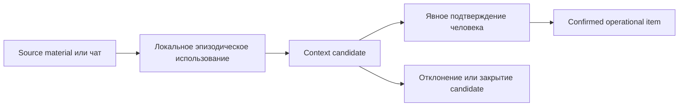

# Operational Context v0: архитектурный контракт

## Статус и назначение

Этот документ — нормативный контракт OC-0 для последующих delivery-slices Operational Context. Он определяет целевую семантику v0 до реализации runtime, хранилища и пользовательского интерфейса. Наличие более ранних project-context записей или read-only Context Assembler не доказывает соответствие этому контракту: они могут быть использованы только после отдельной проверки и адаптации.

Operational Context (OC) — подтверждённое актуальное рабочее состояние, применимое сейчас к конкретному пользователю, проекту или локальному системному окружению. OC не является второй долговременной памятью и не является журналом всех событий.

Роли слоёв разделены следующим образом:

| Слой | Ответственность |
|---|---|
| Scribe | Формирует и обновляет долговременную Memory только через её собственный контролируемый процесс. |
| Lore | Извлекает релевантные долговременные знания, историю и обоснования из Memory. |
| Operational Context | Хранит подтверждённое актуальное состояние с ограниченной областью видимости. |
| Context Assembler | Read-only собирает ограниченный пакет из запроса, eligible OC, Lore/Memory и нужной истории диалога. |
| Heart | Ведёт диалог только поверх уже подготовленного пакета; не создаёт и не повышает OC. |
| Orchestrator | Управляет workflow там, где он нужен, но не обязан быть прокси каждого простого read-only обращения. |

## Инварианты v0

1. Текущим источником истины является только `active` и `confirmed` item, прошедший scope и privacy eligibility и имеющий валидное immutable evidence подтверждения.
2. Project item проекта A никогда не выдаётся проекту B. Совпадение текста, пользователя, источника или идентификатора документа не является разрешением на передачу между проектами.
3. Содержимое приватного материала не становится OC, Memory или глобально доступными метаданными автоматически.
4. Каждый доступный item сохраняет стабильный идентификатор, subject identity, scope и безопасные provenance/confirmation-ссылки. Assembler не отделяет значение от этих свойств.
5. OC выражает текущее применимое состояние; Memory хранит устойчивое знание, историю, rationale и принятые решения. Конфликт не разрешается скрытым слиянием.
6. Пустой eligible набор OC — нормальный результат. Он не даёт права подменить отсутствие состояния непроверенным источником или полным дампом проекта.

## Минимальная модель operational item

В v0 item содержит только следующие поля.

| Поле | Назначение |
|---|---|
| `id` | Непрозрачный стабильный идентификатор item; не меняется при чтении. Новая редакция получает новый `id`. |
| `scope` | Ровно `user`, `project` или `system`; определяет видимость и изоляцию. |
| `scope_ref` | Безопасная ссылка на владельца scope: для `user` — пользователя, для `project` — проект/workspace, для `system` — локальное системное окружение. |
| `kind` | Ограниченный прикладной тип, определяющий интерпретацию значения. OC-1 обязан задать закрытый начальный набор и не принимать произвольные типы. |
| `subject_ref` | Обязательный стабильный безопасный идентификатор предмета состояния внутри `kind`; не содержит raw private content и не выводится из произвольного `value`. |
| `value` или `reference` | Небольшое подтверждённое состояние либо ссылка на canonical entity. Item обязан иметь хотя бы одно; оба допускаются, если значение необходимо для работы, а reference определяет его canonical authority. |
| `provenance` | Ссылки на source/candidate и, при наличии, на canonical Memory entity; не содержит исходный приватный текст. |
| `created_at`, `updated_at` | Время создания и последней контролируемой смены записи. |
| `lifecycle` | `active`, `superseded` или `retired`. |
| `confirmation` | `confirmed` для доступного runtime item; само значение допустимо только вместе с валидным `confirmation_ref`. Остальные состояния принадлежат candidate-потоку и не являются operational items. |
| `confirmation_ref` | Обязательная immutable audit/promotion reference для confirmed item. Событие доказывает candidate/source transition, opaque `actor_ref`, timestamp и action; raw персональные данные и source content в item не копируются. |
| `sensitivity` | Метка обработки и допустимой выдачи: минимум `standard` или `restricted`. |
| `supersedes_id` | Необязательная ссылка на непосредственно заменённый item. |

Operational identity — точное сочетание `scope + scope_ref + kind + subject_ref`. Оно применяется для applicability, conflict detection и replacement semantics; значение `value` не может неявно определять subject. Confidence не входит в operational item v0. Он может существовать у candidate как сигнал для человека, но после human confirmation не является источником authority. Произвольные графовые связи, оценка релевантности и поля «на будущее» не входят в модель v0.

## Scope и изоляция

| Scope | Семантика | Кому может быть виден |
|---|---|---|
| `user` | Подтверждённое рабочее предпочтение или состояние конкретного пользователя, не являющееся свойством проекта. | Только тому же authenticated/local user; доступ в проектном пакете возможен лишь при явном выборе user scope для этого пользователя. |
| `project` | Текущее состояние одного проекта/workspace. | Только запросам того же project/workspace и user, имеющего к нему доступ. |
| `system` | Локальное состояние системного окружения Gaia, не содержащее проектных или пользовательских фактов. | Только локальному runtime того же system environment; никогда не используется как путь раскрытия project/user данных. |

`scope_ref` обязателен. Item без него или с неизвестным scope fail-closed исключается. Project query обязан иметь точное равенство `project/workspace id`; wildcard, поиск по названию проекта и fallback на «последний проект» запрещены. User и system items не получают видимость в другом пользовательском или системном окружении по умолчанию.

Scopes являются разными dimensions, а не универсальной шкалой приоритета: project item выражает project state, user item — состояние/предпочтение пользователя, system item — ограничение среды. Закрытый kind registry определяет для каждого `kind` допустимые scopes, семантику `subject_ref` и, только при реальной необходимости, явное правило composition/precedence для одновременно применимых items. Если у `kind` нет такого явного правила, конфликтующие applicable items не выбираются по общей scope ladder: retrieval возвращает `ambiguity` или `unresolved_conflict`, а решение проходит human gate.

## Lifecycle и замена

Допустимые состояния OC:

| Lifecycle | Значение | Runtime retrieval | Audit/provenance |
|---|---|---|---|
| `active` | Актуальный подтверждённый item. | Допускается при прочих eligibility-проверках. | Сохраняется. |
| `superseded` | Заменён конкретной новой редакцией. | Исключается. | Сохраняется с replacement audit evidence и двусторонне проходимым lineage. |
| `retired` | Закрыт без нового актуального значения. | Исключается. | Сохраняется с причиной и retirement audit evidence. |

Создание нового значения не перезаписывает старое: после подтверждённого replacement для той же operational identity прежний item становится `superseded`. Пока replacement не подтверждён, прежний `active` item остаётся единственным текущим состоянием; candidate не конкурирует с ним в runtime. `supersedes_id` хранится только на новой записи; store обязан позволять детерминированно пройти lineage в обе стороны, поэтому отдельное mutable поле old → replacement не требуется. `retired` используется, когда состояние больше не применимо и заменять его нечем; action и timestamp retirement сохраняются в immutable audit evidence. Исторические записи доступны только для audit/provenance с теми же scope/privacy ограничениями, но не участвуют в обычном retrieval.

## Candidate и human gate

Путь формирования отделён от runtime authority:



Candidate содержит proposed scope/kind/subject_ref/value/reference, безопасную provenance и при необходимости confidence. Он не участвует в retrieval и не меняет `active` item. Human confirmation одновременно проверяет scope, sensitivity, subject identity, содержание/reference и replacement semantics. Успешная promotion создаёт immutable audit/promotion event с candidate/source transition, opaque `actor_ref`, timestamp и action; его reference записывается в `confirmation_ref`. Только `confirmation=confirmed` вместе с валидным `confirmation_ref` делает item runtime-visible.

В v0 автоматические изменения запрещены для semantic content: Gaia не может самостоятельно повышать факт из чата, документа, транскрипции или другого материала в OC, заменять active item либо снимать confirmation. Допустимы только технические операции без изменения смысла: создание candidate, добавление безопасной provenance к тому же candidate, создание неизменяемого audit evidence для выполненного контролируемого действия и детерминированное исключение невалидной/устаревшей записи.

## Privacy boundary

| Стадия | Допустимо | Запрещено |
|---|---|---|
| Ephemeral/local use | Использовать материал в текущей разрешённой локальной операции согласно storage/protection contracts. | Делать его глобальным контекстом, писать исходный текст в логи или MemoryHub. |
| Candidate extraction | Создать отделённый candidate с минимальным предложенным фактом и безопасной ссылкой на provenance. | Автоматически подтверждать candidate или раскрывать source другому scope. |
| Promotion | По явному действию сохранить лишь выбранный, минимально необходимый value/reference, scope и sensitivity. | Копировать документ целиком, повышать невыбранные фрагменты или ослаблять export/privacy ограничения. |

`restricted` item выдаётся только consumer, который одновременно прошёл scope eligibility и имеет разрешённый privacy contract. Если такой contract не доказан, item исключается с безопасной причиной без раскрытия значения. Provenance и диагностика не должны содержать raw source, путь к приватному файлу, цитату или скрытые идентификаторы. Действующие [контракт хранения и безопасности](SECURITY_STORAGE_POLICY.md), [модель хранения](STORAGE_MODEL.md) и [защитный контур](PROTECTION_PIPELINE.md) имеют приоритет для материала и его производных.

## Граница с Memory

Memory — canonical home для долговременных знаний, истории, rationale и решений. OC — canonical home только для текущей применимости состояния. Если current state основан на canonical Memory decision/entity, OC хранит reference на него вместо второй полной копии. Например, active architecture constraint ссылается на `DEC-123`, а Memory остаётся местом самого решения и его обоснования.

Материализованное `value` допускается лишь когда для текущей работы нужен небольшой изменяемый факт, который не является самостоятельной durable knowledge entity. Если такой факт становится устойчивым знанием/решением, его canonical запись создаётся процессом Memory/Scribe, а OC в дальнейшем ссылается на неё.

При конфликте OC и Memory OC имеет приоритет только в вопросе текущего состояния и только при `active + confirmed + eligible`. Memory не переписывается и не подавляется. Если конфликт указывает, что Memory decision более не применимо либо нуждается в пересмотре, создаётся candidate/запрос человеку в соответствующем процессе; OC-0 не вводит автоматическую reconciliation между слоями.

## Retrieval eligibility contract

Будущий retrieval получает минимум: current user, exact current project/workspace, query/task и идентификатор локального system environment. Он возвращает ограниченный набор eligible `active` items вместе с `id`, scope, sensitivity, safe provenance и диагностикой исключений. Retrieval не обязан использовать semantic ranking в v0.

Item eligible, только когда одновременно:

1. `lifecycle=active`, `confirmation=confirmed` и `confirmation_ref` валидно ссылается на immutable confirmation/promotion evidence;
2. scope и `scope_ref` точно совпали с допустимым окружением запроса;
3. sensitivity разрешена consumer и текущему запросу;
4. `kind` поддержан данным consumer;
5. item не находится в неразрешённом конфликте для той же operational identity;
6. item помещается в запрошенный bounded budget без отделения от provenance.

Фильтрация детерминирована. Исключённый item получает одну безопасную причину из закрытого набора, например: `not_active`, `not_confirmed`, `invalid_confirmation_evidence`, `scope_mismatch`, `privacy_restricted`, `unsupported_kind`, `unresolved_conflict`, `budget_exceeded` или `invalid_record`. Эти технические коды предназначены для API/диагностики; UI обязан отображать им понятные русские подписи. Результаты упорядочиваются стабильно по kind-defined applicability/composition rule, затем `updated_at`, затем `id`; при отсутствии явного kind rule конфликтующие applicable items возвращают ambiguity, а не выбираются по scope.

## Context Assembler boundary

Assembler имеет право read-only читать query/task, verified session/conversation context, eligible OC и Lore-selected Memory. Он формирует bounded package для Heart/runtime, сохраняя происхождение и различая authority слоёв:

```text
query/task + eligible Operational Context + relevant Lore/Memory
           + required session context -> bounded context package
```

Assembler не читает raw private sources ради обхода OC, не вызывает Scribe, не создаёт candidates, не подтверждает/promote items, не меняет lifecycle и не разрешает конфликты. Он не заменяет query-scoped выбор выгрузкой «всего известного о проекте». Каждый включённый item остаётся атомарным с `id`, operational identity, sensitivity, provenance и confirmation evidence; невошедший по budget item не обрезается до потери этих связей.

Heart получает только package. Он не считается authority для обновления Memory или OC и не должен интерпретировать отсутствие OC как разрешение на утверждение непроверенного current state.

## Conflict semantics v0

| Случай | Детерминированное поведение |
|---|---|
| Два active OC items противоречат для одной operational identity | Оба исключаются из authority для этого предмета с `unresolved_conflict`; требуется human resolution. |
| Новый item противоречит active item той же operational identity | Новый является candidate до подтверждения; старый остаётся `active`. После подтверждения replacement старый становится `superseded`. |
| Items разных scopes одновременно применимы | Используется только явное composition/precedence rule их `kind`; без такого правила — ambiguity и human gate, без общей scope ladder. |
| OC противоречит Memory | Eligible OC определяет только current state; Memory сохраняется без автоматического изменения. Создаётся задача проверки/кандидат согласно владельцу canonical Memory. |
| Новый source document противоречит confirmed OC | Из него может возникнуть candidate с provenance; confirmed OC не меняется до human confirmation replacement или retirement. |

## Non-goals v0

OC-0 не реализует и не утверждает: redesign Heart; новую агентную оркестрацию; графовую модель OC; автоматическое обучение; сложный semantic ranking; глобальный redesign Memory; автоматическую promotion фактов из любых документов; полнофункциональные runtime/store/UI; миграцию старых context records; экспорт OC или ослабление действующих privacy boundaries.

## Критерии приемки последующих slices

Каждый OC-1+ slice должен доказать относящиеся к нему критерии синтетическими тестами без рабочих данных:

1. Нельзя создать runtime-visible item без stable `id`, operational identity (`scope/scope_ref/kind/subject_ref`), lifecycle, `confirmation=confirmed`, валидного `confirmation_ref`, sensitivity и safe provenance.
2. Project A item не выбирается в Project B; отсутствие exact workspace/user/system identity fail-closed.
3. Candidate из приватного материала не доступен до явного подтверждения, а raw content не появляется в diagnostics/export.
4. Superseded и retired items сохраняют audit lineage, но не попадают в runtime retrieval.
5. Замена не меняет current authority до confirmation replacement; lineage replacement/retirement двусторонне проходим и имеет immutable audit evidence.
6. Разрешённый current OC и Lore/Memory сохраняются как раздельные слои с provenance; конфликт не сливается автоматически.
7. Конфликтующие active items не дают произвольного ответа; без явного kind-defined composition rule выдаётся ambiguity/исключение с безопасной диагностикой, а не применяется общая scope precedence.
8. Bounded package не превращается в dump всего проекта и не обрезает включённый item от его provenance/scope/privacy metadata.
9. Все пользовательские тексты переводят технические lifecycle, confirmation и exclusion statuses в понятный русский язык.

## Декомпозиция реализации

| Slice | Результат и граница |
|---|---|
| OC-1 Store | Минимальная schema/model, closed kind registry, scoped persistence, subject identity, immutable confirmation/replacement/retirement audit evidence, lifecycle и audit/provenance без runtime consumer. Не мигрирует старые записи без отдельного решения. |
| OC-2 Retrieval | Deterministic eligibility/filtering, stable ordering, ambiguity и безопасная диагностика; без semantic ranking. |
| OC-3 Context Assembler | Read-only bounded package из OC, Lore и необходимой истории; без promotion и без redesign Heart. |
| OC-4 Review / UX | Экран кандидатов и контролируемые действия confirmation, replacement, retirement и conflict resolution с понятными русскими подписями. |
| OC-5 Runtime integration | Узкая передача готового package в Dialogue/Heart и проверка end-to-end privacy/scope boundaries; без обязательной проксизации всех вызовов через Orchestrator. |

Каждый slice начинается с проверки этого контракта и действующих storage/privacy contracts. Изменение базовой семантики, scope precedence, privacy gate или Memory boundary требует отдельного архитектурного решения до реализации.
