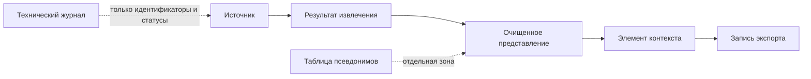

# Модель хранения и происхождения Gaia

Модель применяется только к новым контролируемо принятым материалам. Она не мигрирует и не меняет существующие рабочие пространства.

## Зоны

Локальный каталог `storage` содержит семь изолированных зон: `sources`, `artifacts`, `sanitized`, `context`, `pseudonyms`, `exports` и `metadata`. В Git он исключён. Источники и производные тексты хранятся отдельно от реестра метаданных; псевдонимы — отдельно от очищенных представлений.

## Объекты и идентификаторы

Для новых объектов используются случайные непрозрачные идентификаторы: рабочего пространства, источника, производного результата, элемента контекста и экспорта. Контрольная сумма — отдельное поле целостности и не является публичным идентификатором.

Каждая запись содержит рабочее пространство, время создания, статус, версию схемы, родителей, версию обработчика и при необходимости версию правил. Очищенные представления и производные результаты получают новую версию вместо перезаписи; предыдущая помечается заменённой.

## Приём и повторная обработка

Приём вычисляет контрольную сумму и ищет повтор только в текущем рабочем пространстве. Повтор возвращает существующий источник без второй копии. То же содержимое в другом пространстве создаёт независимый источник. При несовпадении контрольной суммы источник помечается требующим повторного приёма.

Запись сначала создаётся локально, затем атомарно регистрируется. Если реестр не удалось обновить, временная копия удаляется. Восстановление удаляет только неизвестные незавершённые остатки и никогда не помечает их успешными.

## Происхождение, экспорт и миграция

`lineage()` возвращает безопасную цепочку идентификаторов без закрытого содержимого. Экспортная запись содержит только ссылки на версии элементов контекста и по умолчанию запрещена для экспорта. Псевдонимы не включаются в экспортную метаинформацию.

`migration_preview()` — только предварительный просмотр: он считает технические категории и записи без происхождения, ничего не читает из старых источников и ничего не изменяет. Реальная миграция потребует отдельного подтверждения, резервной проверки, работы на копии и возможности отката.

## Совместимость и ограничения

Существующие API, оркестратор, диалоги и Scribe продолжают использовать старые форматы. Новый сервис предназначен для новых управляемых операций и не дублирует старые записи бессрочно. Подключение его к пользовательскому приёму и полноценная обработка контекста остаются последующими этапами.
